# The introduction of project
Welcome to the virtual pet project, now let me introduce the function of this software.

## What is it?
It's a software that can let you adopt a virtual pet, it can be a dog or cat. You need to register an account for logining, then you can use this account to adopt your pet.

## What you can do?
Your pet need eat, sleep, wander and play, like a real pet, and every action will change the status of your pet. The status include happiness, hunger, energy. The range of them are in 0 to 100.

# Operation Manual

## 1. Register
You need to register your account at first. You can see these choices after start run the main class.  
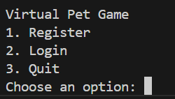  
Now choose 1.  
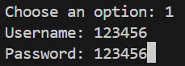  
Input your username and password.(Notice: if the username has already existed, you will not be allowed to create the account)  
## 2. Login
Now we can login our account, choose number 2(If you choose 3,you will exit. You can only choose number 1 to 3 and other chocies will be invalid).  
  
Enter your username and password  
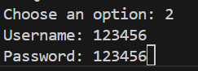
## 3. Create your pet
Now you can create your pet. You can only create your pet once.  
Enter your pet's name, choose it color(you can only choose black, white, brown, golden and gray, other color will be invalid)
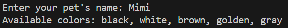
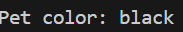  
Then you need to choose pet's type, dog or cat.  
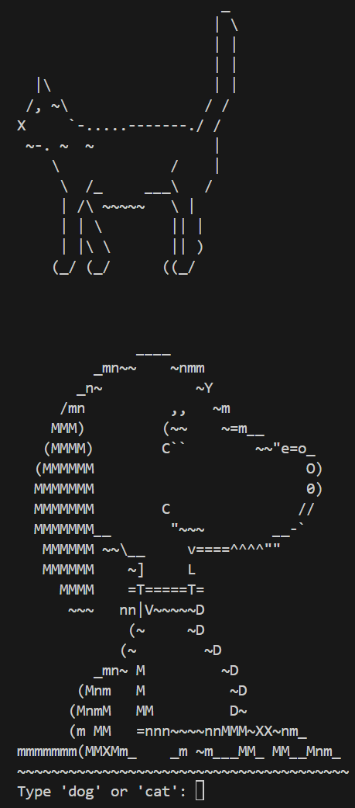

## 4. Actions
Now you are enter the pet menu, you can choose to these thing.
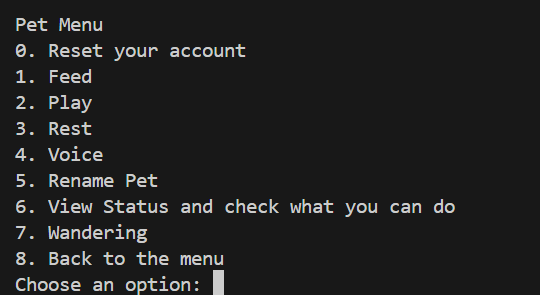
choice 0: reset your username and password
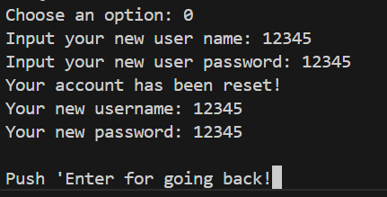  
push 'Enter' to continue  
You can check the information of account in file users.json!  
(Notice: every time you choose choice 1,2,3,4,7 you can see a picture, it can be dog/cat according your pet's type. Push Enter to end it, and you will come to the page of status of pet, push Enter again to see what you can do now, then psuh Enter for going back to the pet menu)
choice 1: Feed your pet, and hunger value will minus 10 
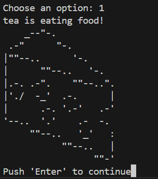  
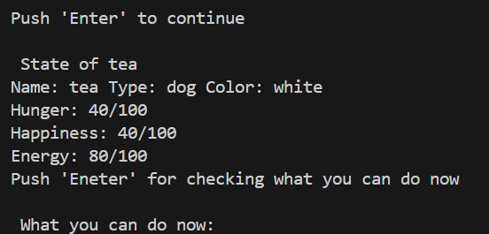  
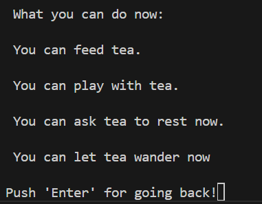  
choice 2: Play with your pet, happiness will add 10, hunger will add 10 and energy will minus 10，We can choose this methode only when happiness<100 and energy>0 and hunger<100.  
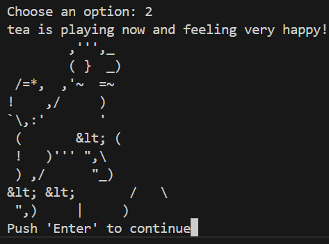  
choice 3: This method can let pet rest, enery plus 40, happiness minus 20 and hunger minus 20. Hunger and happiness will never less than 0.  
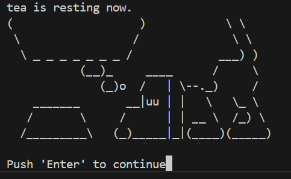  
choice 4: The cat will say meow and dog will say woof  
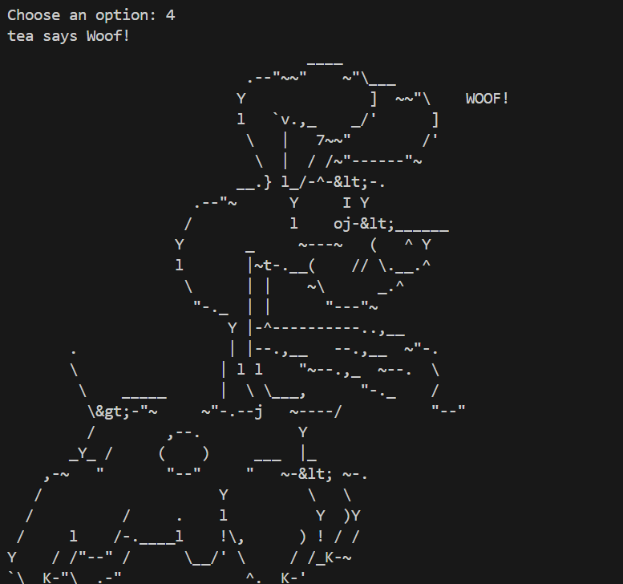
choice 5: Rename your pet. Enter your pet's new name!
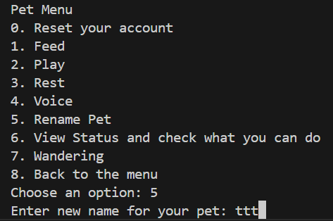  
choice 6: View the status of your pet. Include name, color, type(cat or dog) energy, hunger, and happiness. Then you can push enter to come to the next page and see what interaction you can do now.(Notice: only feed, play, rest, wander included because they are the only chocies need requirement, feel free to choose other choices anytime)  
choice 7: Ask your pet wander, energy minus 10 and hunger add 10, you can choose it only when energy>0 and hunger<100.  
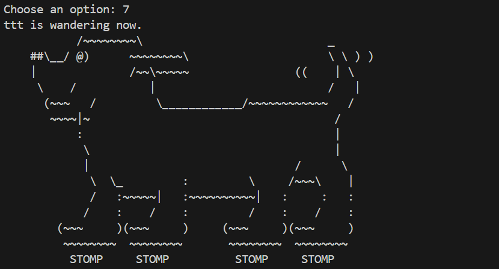
choice 8: Back to the menu(the place include login, register and quit).

# Structure
There are 4 folds of code, control, mapper, pojo, and service. And useers.json is the place we store your account information(include your username,password,and your pet's status)  
The service fold stores UserService.py, which realize the function of user register and authentication and reset. The GameService.py realize the method of game, include every interactions with pet. And it also realize the method for create pet and convert pet information from data to object. 
The control folds include GameController which wrap the GameService class, and offer a method 'start_game' for main.py to call. The UserController wrap the UserService class, get different results of login and register, than output the result with human language to users, it offer login register method for main.py, and reset method for GameService
The pojo fold includes entities we needed. Include User, the object include username, type and status of pet. The pet is the parent class of Cat and Dog, includes the name, color, hunger happiness and energy of pet. And the Cat and Dog include function meow/bark, and the type of pet.  
Mapper is the connector between object and database(here is users.json), read information from it, and give them to the object User, it can also read the object user, and convert it to the data in users.json.

